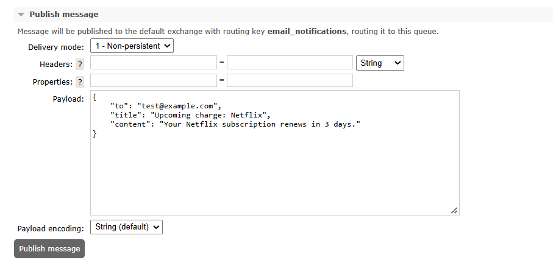
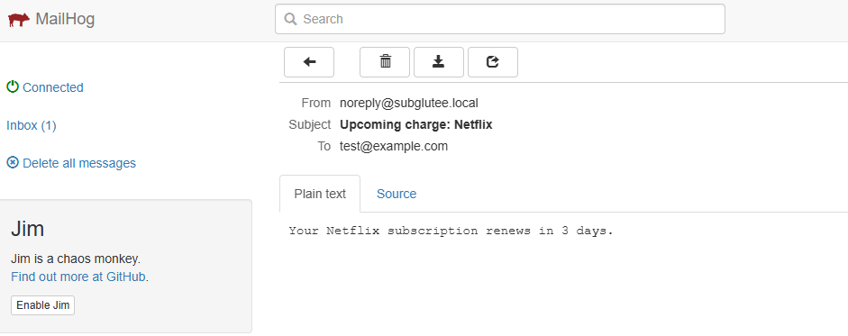
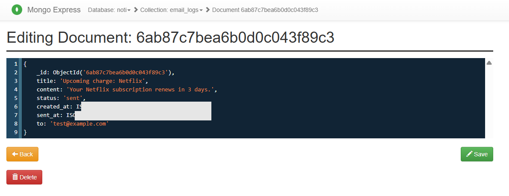

# Subglutee Project - Notification Service

worker consume message จาก RabbitMQ แล้วส่งอีเมลผ่าน SMTP, log ผลลง Mongo

### Message contract

producer (เช่น sgt-scheduler) publish JSON ไป queue `email_notifications`:

```json
{
    "to": "test@example.com",
    "title": "Upcoming charge: Netflix",
    "content": "Your Netflix subscription renews in 3 days."
}
```

| Field     | JSON type | Meaning                                             |
| --------- | --------- | --------------------------------------------------- |
| `to`      | string    | Email ผู้รับ                                        |
| `title`   | string    | หัวข้อ email ที่ producer จัดเตรียมแล้ว             |
| `content` | string    | เนื้อหา plain-text email ที่ producer จัดเตรียมแล้ว |

Notification Service ไม่จำเป็นต้องรู้ schema ของ user หรือ subscription โดยตรง โดย producer เป็นผู้เตรียมข้อมูลสำหรับ email ก่อน publish message เข้า RabbitMQ

### Notification log

หลังจากประมวลผล email แล้ว Notification Service บันทึกผลลง MongoDB collection `email_logs`

| Field        | Meaning                                             |
| ------------ | --------------------------------------------------- |
| `_id`        | ID ที่ MongoDB สร้างให้โดยอัตโนมัติ                 |
| `to`         | Email ผู้รับ                                        |
| `title`      | หัวข้อ email                                        |
| `content`    | เนื้อหา email                                       |
| `status`     | สถานะการส่ง เช่น `sent` หรือ `failed`               |
| `created_at` | เวลาที่สร้าง notification log                       |
| `sent_at`    | เวลาที่ส่ง email สำเร็จ หรือ `null` หากส่งไม่สำเร็จ |

### Structure

```text
consumer/       RabbitMQ consumer, decode message -> เรียก usecase
usecases/       ผูก mailer + repository, ตัดสิน status และสร้าง notification log
mailer/         SMTP adapter
repositories/   Mongo adapter เก็บ notification log
models/         NotificationLog struct
dtos/           EmailMessage queue message struct
routes/         GET /health
config/         env loader + MongoDB/RabbitMQ connection
```

flow: `consumer -> usecases -> mailer (ส่งเมล) + repositories (log ผล)`

### Prerequisite

- Go 1.26
- Docker + Docker Compose
- `make` - `winget install ezwinports.make`
- tools:

```terminal
go install github.com/golangci/golangci-lint/v2/cmd/golangci-lint@latest
go install github.com/evilmartians/lefthook@latest
lefthook install
```

### Setup

```terminal
git clone https://github.com/polar-bear-cu/sgt-noti-service.git
cd sgt-noti-service
lefthook install
cp .env.example .env
go mod download
make compose-up
make run
```

### Run alternatively (container)

```terminal
make image
make container
```

### Useful Commands

Check `Makefile`

### Dev tools

- MailHog UI: `localhost:8025` - ดูเมลที่ส่งออก
- RabbitMQ management UI: `localhost:15672` (guest/guest) - ดูคิว
- mongo-express: `localhost:8089` - ดู log

### Email flow test

1. Restart Go service หลังเปลี่ยน DTO: `Ctrl+C` แล้ว `go run .`
2. เปิด `http://localhost:8088/health` และตรวจ `status: ok`
3. เปิด RabbitMQ Management → Queues and Streams → `email_notifications` → Publish message
4. Publish JSON ตาม message contract ด้านบน
5. เปิด MailHog แล้วตรวจว่า email subject ตรงกับ `title`, body ตรงกับ `content` และผู้รับถูกต้อง
6. เปิด Mongo Express → database `noti` → collection `email_logs`
7. ตรวจ record ว่ามี `to`, `title`, `content`, `status`, `created_at`, `sent_at` ตรงตามที่ service ประมวลผล

ตัวอย่างการ Publish JSON:



ตัวอย่างผลลัพธ์ใน MailHog:



ตัวอย่างผลลัพธ์ใน Mongo Experss:


